# 라스트 어드벤처 기획
# [목차]

1. [컨셉](#컨셉)  
2. [관련이미지 and 동영상](#관련이미지-and-동영상)  
3. [대표 이미지](#대표-이미지)  
4. [컨셉 and 대표이미지 기반 작품묘사](#컨셉-and-대표이미지-기반-작품묘사)  
5. [라스트 어드벤처 구성 요소](#라스트-어드벤처-구성-요소)  
6. [게임시스템디자인](#게임시스템디자인)  
    a. [게임 오브젝트 분해](#1-게임-오브젝트-분해)  
    b. [파라미터(속성)](#2-파라미터)  
    c. [행동](#3-행동)  
    d. [상태](#4-상태)  
    e. [플레이어 캐릭터 속성(파라미터)](#5-플레이어-캐릭터-속성)  
    f. [게임의 규칙](#6-게임의-규칙)  
    g. [게임에서 사용될 공식](#7-게임에서-사용될-공식)
7. [요구사항](#요구사항-A)  
    a. [요구사항(6주)](#요구사항-B)
8. [시간별 흐름도](#시간별-흐름도)
9. [키보드 이벤트에 대한 흐름도](#키보드-이벤트에-대한-흐름도)
10. [용어정리](#용어정리)
11. [개발작업 일정](#개발작업-일정)
12. [주차별 실습]  
    a. [1~2주차 실습](files/w0102/1and2_Week.md)  
    b. [3주차 실습](files/w03/w03.md)  
    c. [4주차 실습](files/w04/w04.md)  
    d. [5주차 실습](files/w05/w05.md)  
    e. [6주차 실습](files/w06/w06.md)  

# [컨셉]
## 메인컨셉 : 어드벤처(Advanture)
- 세계전쟁으로 인한 멸망이 진행된 맵을 보며, 전쟁이 얼마나 잔혹한지를 겪게 해주는 어드벤처 게임으로, VR로 구현할 예정

### 서브컨셉 1 : 아포칼립스
- 계속되는 눈보라와 주변 지형 등을 통해 아포칼립스적 분위기를 눈치챌 수 있게 합니다.
    
### 서브컨셉 2 : 로드무비
- 플레이어가 만들어진 길에 따라 퀘스트가 진행되는 연출을 사용할 예정입니다.
    
### 서브컨셉 3 : 그래픽
- 만지기만 해도 얼어붙을 거 같은 지형들과 주변 환경 등을 통해 환경에 대한 사실적 요소를 추가 할 예정입니다.
    
### 서브컨셉 4 : 퍼즐
- 플레이어에 반응하는 NPC 등을 통해 앞으로 살아나가야 하는데 필요한 물품 등을 구할 수 있는 퍼즐을 넣을 예정입니다..
  
# [관련이미지 and 동영상]
- 이미지
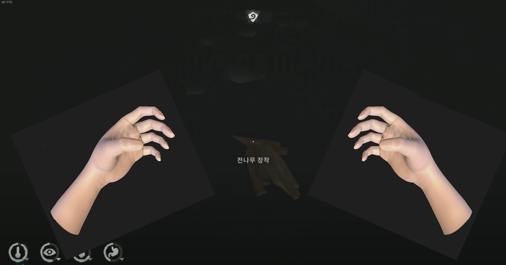
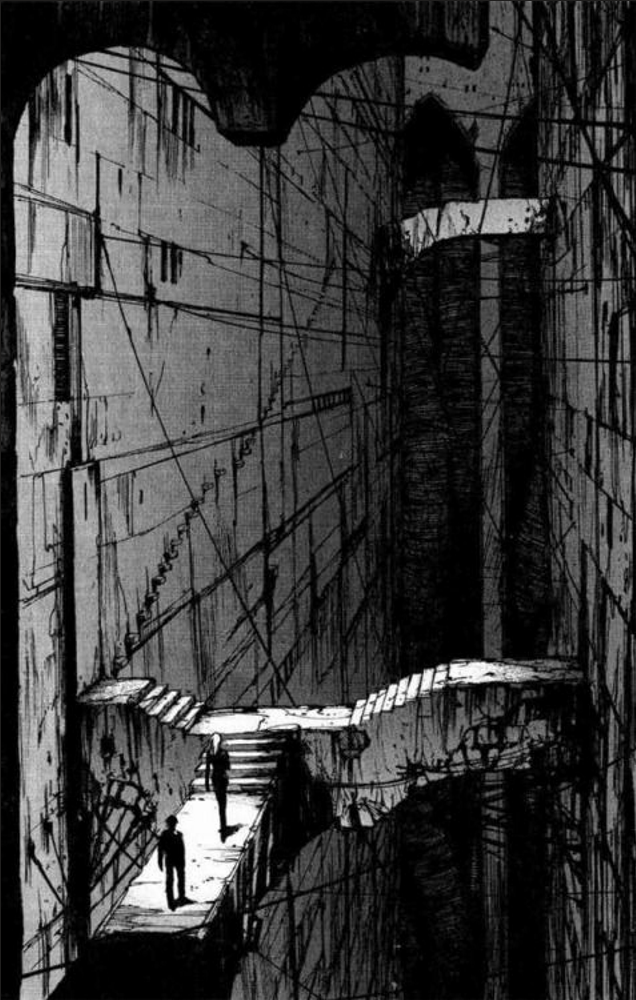
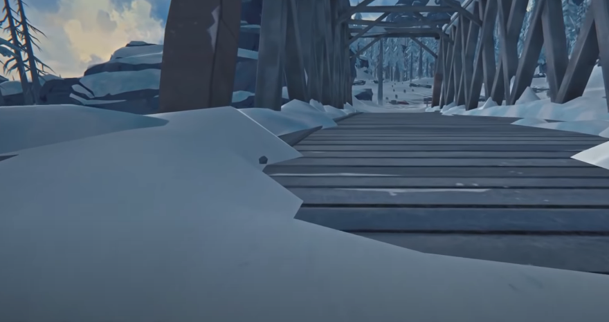
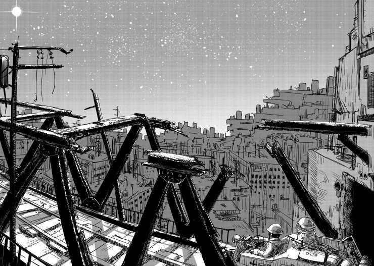

- 동영상
> VR 컨트롤러 관련 참고 영상

[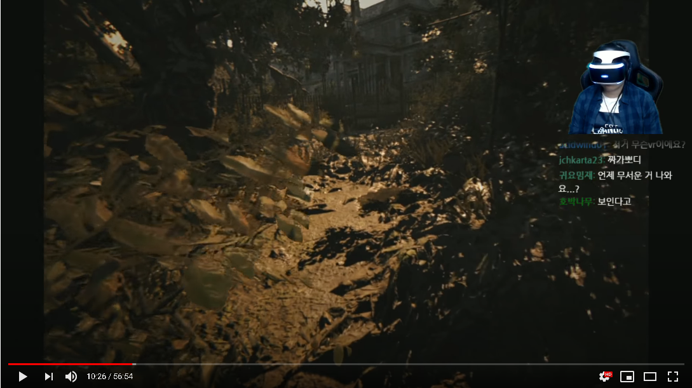](https://www.youtube.com/watch?v=JJVLjTLIW-Y)
[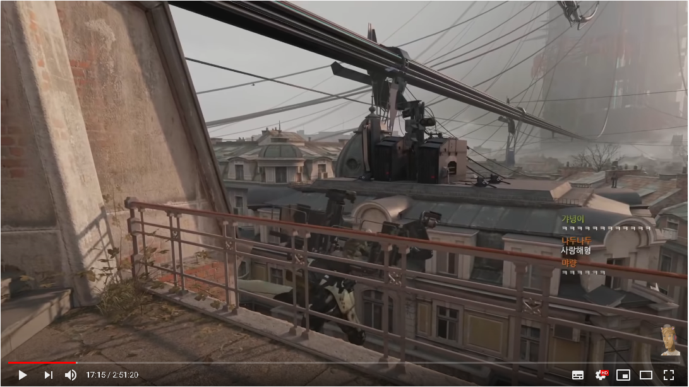](https://www.youtube.com/watch?v=c3C0qMbMxq0)

> VR 내부시스템 및 서브컨텐츠 참고 영상

[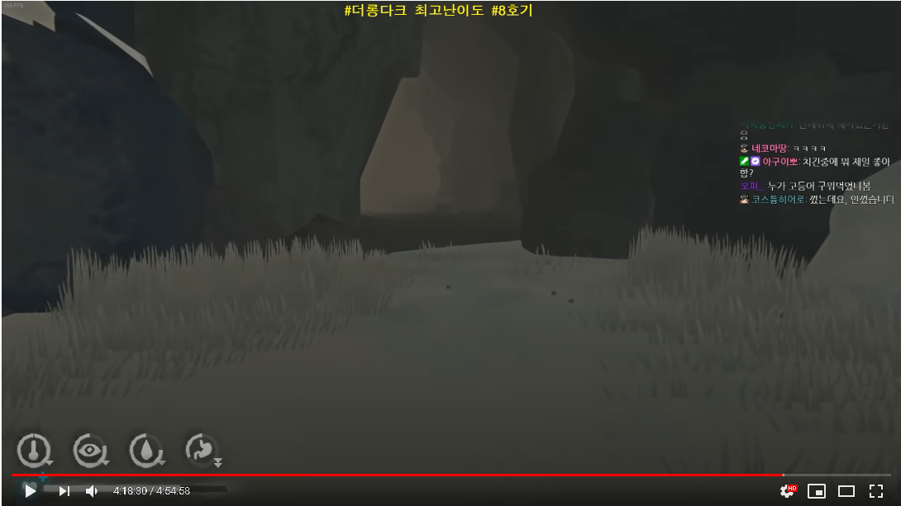](https://www.youtube.com/watch?v=Ue2938dkp1I&t=15102s)
[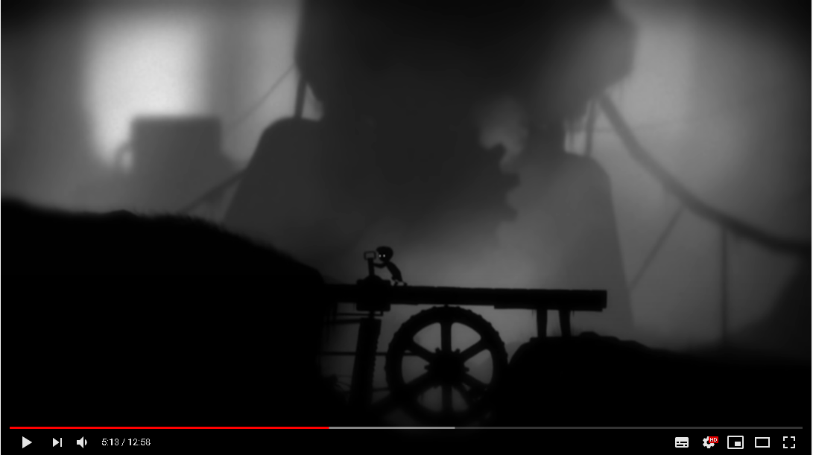](https://www.youtube.com/watch?v=59qGZfQL4HE)

  
# [대표 이미지]
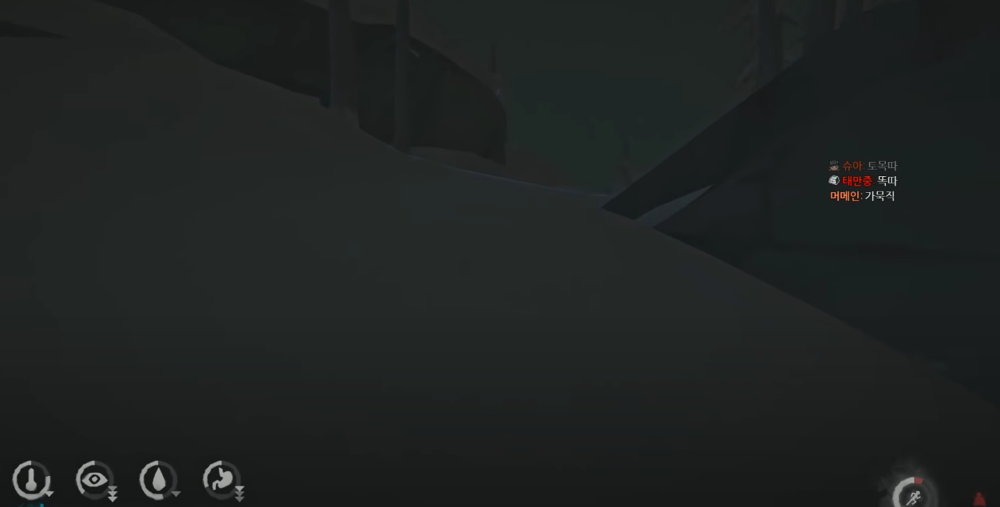

  
# [컨셉 and 대표이미지 기반 작품묘사]
### 대표이미지 기반 : 
> 플레이어의 주변의 시야에 제한을 두어 공포적이고 차가운 연출을 사용하며, 흐릿하게 보이는 길을 따라 로드무비를 진행하는 모습입니다.

### 컨셉 기반 : 
> 제한된 시야지만 길을 따라 퀘스트 등을 해결하면서 생존해가며 어딘가 끝이 있을 최상층을 항해 나아갑니다.

  
# [라스트 어드벤처 구성 요소]

## 1. 메커니즘   
> [도전 과제]
1. 불편하고 기괴하지만 계속해서 나아가게 만드는 기이한 게임!
2. 어둡고 충격적이지만 무시무시하게 아름다운 환경이 보인다!
3. 이러한 세상의 비밀을 알아가라!

> [재미 요소]
1. 불편한 시스템이 오히려 공포심을 자극시켜 마치 공포스러운 분위기의 맵을 탐험하는 듯한 표현을 줍니다.
2. 맵에 대한 시선을 좁히면서 무엇이 나올지 모르는 환경을 조성하지만 맵이 잘 보이는 구간은 아름답게 연출하여 극적인 묘사를 보여줍니다.
3. 특수한 사정이 있는 듯 한 맵의 분위기로 유저가 현재 세계에 대한 궁금증을 자극시킵니다.

## 2. 이야기
> 오래 전 벌어진 세계 대전급의 전쟁으로 인해 남은 것은 폐허가 된 도시와 무기들밖에 없는 세상에서 주인공은 잠에서 깨어난다.
> 주인공이 개조한 차를 타고 다니며 오늘도 살아남기 위한 여행을 시작한다.
> 그러던 어느날 타고있던 차의 기름이 다 떨어져 나갈때 쯤 한 남자를 만나게 되는데...

> [만들게 된 배경] 
##### 전쟁 등으로 멸망한 세계에 대한 모험심 등을 자극시키는 VR로 이루어진 어드벤처 게임을 만들어 보는 것이 좋다 생각하여 만들게 되었습니다.

> [카메라 관점]
##### 직접 생존하는 듯한 느낌을 들게 하기 위하여 1인칭 시점을 사용한 카메라를 이용할 예정입니다. VR 시스템의 내부적으로 지원하는 카메라로 구성할 예정입니다.

## 3. 미적요소
> 1. 주변이 어둡고 주로 눈이 쌓여 있는 모습을 주어 멸망적 느낌을 줄 예정입니다.
> 2. 대부분 어두운 컬러(회색 등)을 이용하여 차가운 연출을 할 예정입니다.
> 3. 눈보라가 몰아치고 어딘가 부서지는 듯한 음성 등을 넣어 폐허가 된 환경에 대한 이해를 도울 예정입니다.

  
# 게임시스템디자인

## 1. 게임 오브젝트 분해

|연번|오브젝트 이름|오브젝트 이미지|
|:---:|:---:|:---:|
|1|플레이어|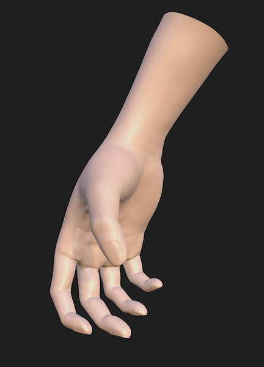|
|2|퀘스트NPC|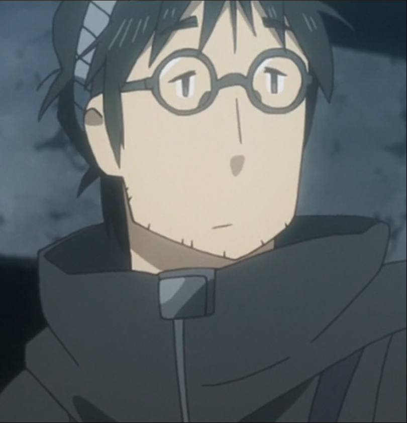|
|3|도구ㅡ이동수단|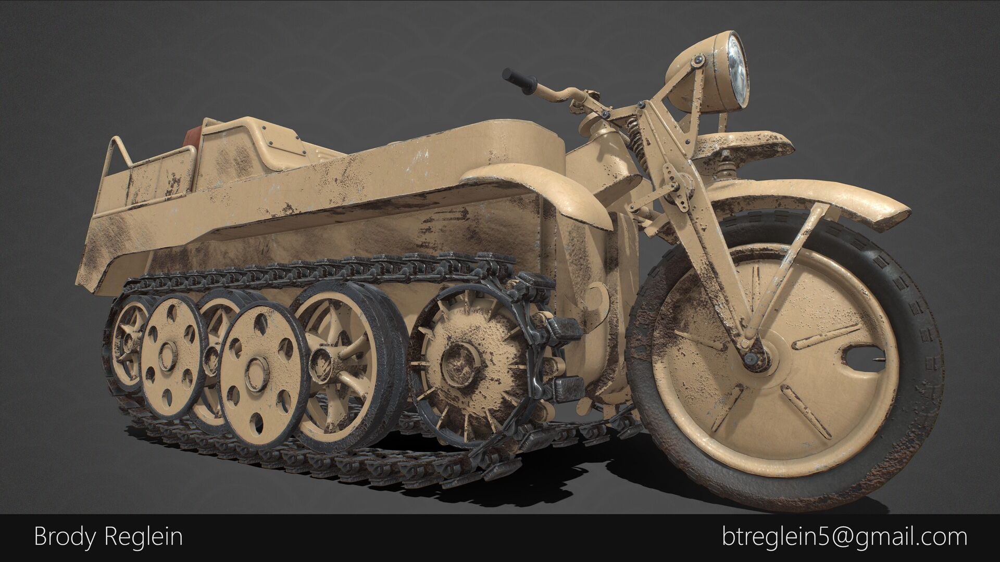|
|4|도구ㅡ연료|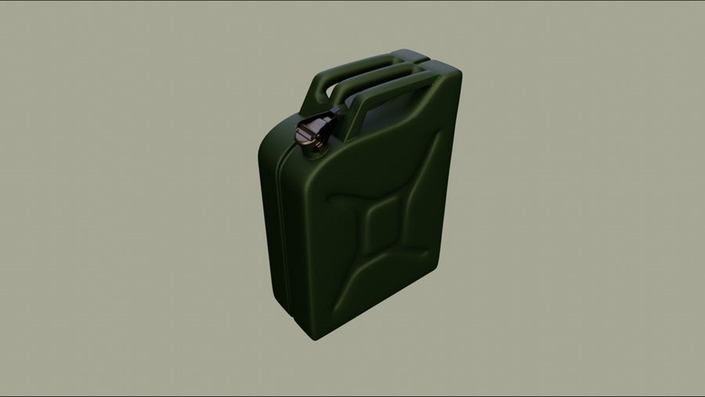|
|5|도구ㅡ식량|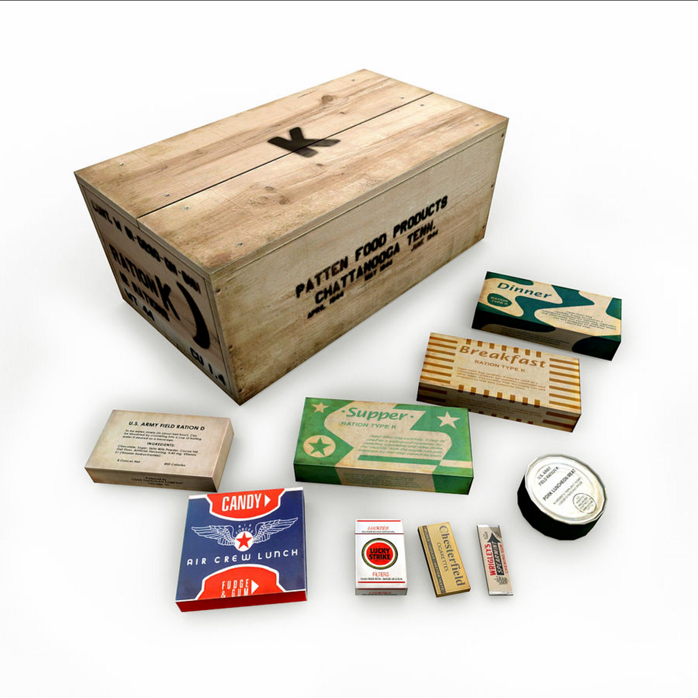|
|6|맵ㅡ첫번째 맵(Man)|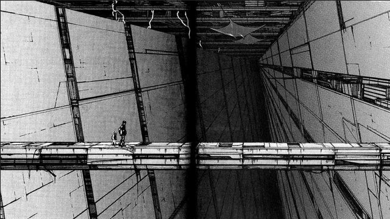|
|7|맵ㅡ두번째 맵(파이프)|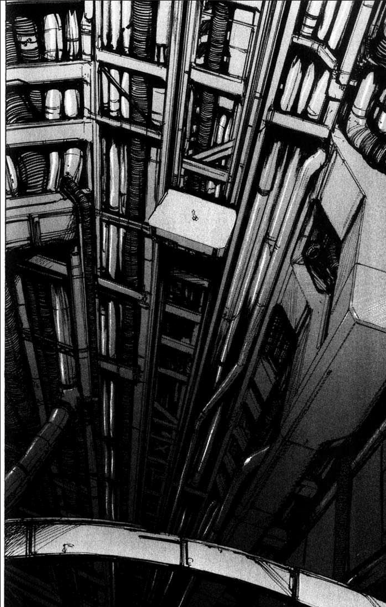|
|8|맵ㅡ세번째 맵(Tower)||

## 2. 파라미터   

> [Player]

|속성|속성값|설명|비고|
|:---:|:---:|:---:|:---:|
|카메라|SteamVR에 내장된 카메라를 따라간다.|플레이어의 카메라 좌표||
|포만감|Player의 포만도는 최대 10으로 유지하되 Amount를 사용해서 플레이어의 UI에 노출되도록 한다.|플레이어의 포만도 수치||
|이동|Player의 Move는 5km/h으로 설정하며 좌측 Grip을 사용해 움직인다.|키 입력을 받아 카메라가 보고있는 방향으로 전진||
|시야 제한|Player의 시야는 Player를 중심으로 5의 거리만큼만 보이게 하며 그 이상으로 갈 시 빛의 값을 약하게 조정한다.|일정이상 떨어진 오브젝트는 희미하게 보이게 함||

> [NPC]

|속성|속성값|설명|비고|
|:---:|:---:|:---:|:---:|
|카메라|플레이어와의 거리가 8 이하로 될 시 행동을 Active로 한다.|플레이어와의 거리를 계산하여 상호작용이 가능하도록 활성화하고, 안내 생성||

> [도구(자동차)]

|속성|속성값|설명|비고|
|:---:|:---:|:---:|:---:|
|이동|차의 이동은 10km/h로 하되 기어의 변속에 따라 20km/h까지 늘어난다. Player의 좌측 Grip을 통해 이동한다.|자동차 탑승시의 이동||
|연료|연료의 게이지는 최대 100으로 계산하되, 1분당 10씩 줄어들게 한다.|자동차 이동에 필요한 연료. 수치가 0일때 이동 불가||
|거리|플레이어와의 거리가 3 이하가 될 시 플레이어의 UI 중앙에 이름과 원을 표시한다.|플레이어와 거리를 계산하여 상호작용||
|회전|플레이어의 우측 Touchpad에 따라 전진/후진/우회전/좌회전을 구분한다.|플레이어의 컨트롤러 입력을 받아 방향값 추가||

> [도구(연료)]

|속성|속성값|설명|비고|
|:---:|:---:|:---:|:---:|
|충전|연료의 최대값은 100으로 하되, 초당 20 ~ 30씩 낮아지며 0 이하가 되면 사라진다. 동시에 자동차의 연료 게이지가 연료통의 값에 비례하여 충전된다.|자동차에 이 오브젝트를 사용하면 연료 충전||

> [도구(식량)]

|속성|속성값|설명|비고|
|:---:|:---:|:---:|:---:|
|섭취|식량의 최대값은 100으로 하되, 초당 20 ~ 30씩 낮아지며 0 이하가 되면 사라진다. 동시에 Player의 포만감이 식량의 값에 비례하여 회복한다.|플레이어에 이 오브젝트를 사용하면 포만도 충전||

## 3. 행동

> [NPC]

|행동|설명|
|:---:|:---:|
|대기|대기상태 애니메이션 반복|
|대화가능|안내창표시, 대기상태 애니메이션 반복|
|대화중|대기상태 애니메이션 반복, 플레이어를 바라봄|

> [도구(자동차)]

|행동|설명|
|:---:|:---:|
|탑승 전|플레이어가 일정 이상 다가올 경우 화면 중앙에 원과 이름 등을 표시해 오브젝트의 강조효과를 부과함|
|탑승|플레이어가 획득중인 상태로 변경, 강조효과 사라짐|
|출발|바퀴 애니메이션 작동|

> [도구(식량 / 연료)]

|행동|설명|
|:---:|:---:|
|미습득|플레이어가 일정 이상 다가올 경우 화면 중앙에 원과 이름 등을 표시해 오브젝트의 강조효과를 부과함|
|습득|플레이어가 획득중인 상태로 변경, 강조효과 사라짐|
|섭취/충전|해당하는 파라미터 충전 후 빛나며 사라짐|

## 4. 상태

> [NPC]

|현상태|전이상태|전이조건|
|:---:|:---:|:---:|
|대기|대화가능|특정 거리 이내에 플레이어가 접근|
|대화가능|대화중|대화가능 상태에서 플레이어가 특정 버튼을 누름|
|대화중|대화가능|대화가 끝나면 자동으로 전이|
|대화가능|대기|지정된 거리 밖으로 플레이어가 이동|

> [도구(자동차)]

|현상태|전이상태|전이조건|
|:---:|:---:|:---:|
|탑승 전|탑승|플레이어가 탑승|
|대기|출발|습득 상태, 플레이어가 탑승 후 이동 버튼을 클릭|
|출발|대기|습득 상태, 플레이어가 정지 행동을 취함|
|하차 전|하차|플레이어가 하차|

> [도구(식량)]

|현상태|전이상태|전이조건|
|:---:|:---:|:---:|
|미습득|습득|플레이어가 컨트롤러를 사용해 물건을 집어 올림|
|습득|미습득|플레이어가 물건을 손에서 놓음|
|대기|섭취|플레이어가 습득상태인 식량을 얼굴쪽으로 가져감|

> [도구(연료)]

|현상태|전이상태|전이조건|
|:---:|:---:|:---:|
|미습득|습득|플레이어가 컨트롤러를 사용해 물건을 집어 올림|
|습득|미습득|플레이어가 물건을 손에서 놓음|
|대기|충전|플레이어가 습득상태인 연료를 자동차의 주유구로 가져다 |

## 5. 플레이어 캐릭터 속성

|속성|영문명칭|설명|비고|
|:---:|:---:|:---:|:---:|
|포만도|Hunger|Player는 일정 포만도를 가지며 시간에 비례해 낮아진다. Speed값에 영향을 주며, 0이 되면 Player의 이동속도는 0.5km/h로 조정한다.||
|오브젝트 상호작용|Object Choice|플레이어는 상호작용하는 오브젝트에 접근 시 화면 중앙에 원과 이름이 표시된다.||
|이동|Move|플레이어는 앞으로 움직일 수 있다.||
|차 이동|Car Move|자동차는 플레이어가 탑승 시 플레이어의 Touchpad와 Grip으로 움직인다.||

## 6. 게임의 규칙

### 1. 핵심 규칙
- 개발자가 만든 로드에 따라 이동하며 설계된 퀘스트의 동선을 따라간다.
- 최후의 엔딩에 도달한다.

### 2. 보조 규칙
- 낮아지는 포만도에 대해 식량으로 보충한다.
- 낮아지는 차의 연료에 대해 연료를 보충한다.
- 부족해지는 식량과 연료를 찾을 퀘스트를 진행하여 이를 해결한다.

## 7. 게임에서 사용될 공식

### 1. 오브젝트의 거리에 따라 보조UI가 뜬다.

### 2. 캐릭터의 시야 범위는 좁으며, 주변 환경은 대체로 어두운 빛을 가진다.

### 3. 캐릭터의 이동은 기본 걷기(5km/h)를 유지하며, 차에 탑승시 차 이동소도는 10km/h에서 20km/h까지 증가한다.

### 4. 캐릭터의 상호작용할 오브젝트는 플레이어의 거리에 따라 플레이어 중앙의 원과 이름(보조UI)으로 구분한다.

### 5. 게임 클리어는 최종 맵에 도착하여 퀘스트를 클리어시 동작하며, 게임 오버는 Player의 포만도가 0 일 때 특정 시간(10분)이 지나면 게임 오버가 작동하여 세이브 포인트로 보내게 된다.

### 6. 세이브 포인트는 Player가 중요 포인트(NPC 상호작용, 씬 전환 등)를 만날 때 마다 자동 저장되며 수동 저장은 없다.

  

# 요구사항 A

1. 타이틀이 잠깐 나온 뒤 시작화면(로비), 게임화면 총 2개의 화면이 있다.
2. 시작화면(로비)에는 PRESS ANY KEY와 함께 본 게임으로의 접속을 유도한다.
3. VR기계의 컨트롤러 아무버튼(되도록 Grip)이 눌러지면 본 게임에 접속하면서 약간의 연출(FadeIn/Out)이 작동한다.
4. 게임화면(PlayerUI)에서는 플레이어의 손(컨트롤러)가 있다.
5. 플레이어는 포만도를 가지며, 차량 오브젝트에는 연료 게이지를 가진다. 포만도와 연료게이지의 최대값은 300으로 고정하되, 수치변환은 %단위로 구분한다.
7. 플레이어의 포만도는 시간에 비례하여 줄어들며, 차량의 연료 게이지는 플레이어의 탑승 후 상호작용 시간에 비례하여 줄어든다. 이때 포만도와 연료게이지는 분당 5%단위로 줄어들게 된다.
8. 플레이어의 포만도와 차량의 연료게이지는 각각 식량과 연료를 통해 증가시킬 수 있다. 이때 증가하는 양은 한개의 오브젝트 당 값을 최대 50% 충전 할 수 있게 만든다.
9. 플레이어의 포만도가 0가 되고 일정시간이 흐르면, 플레이어의 사망표시(게임오버)를 띄우며, 메뉴UI를 노출시킨다.
10. 메뉴UI의 이어하기를 선택하면 사망하기 전 세이브 포인트로 이동한다.
11. 세이브 포인트는 자동등록이며, NPC, 차량, 맵 이동 등 중요 오브젝트와의 상호작용과 연관되어 등록된다.
12. 플레이어가 오브젝트(NPC 포함)에 가까이 가면 보조 UI를 띄운다.
13. 보조 UI는 화면 중앙에 작은 원과 함께 해당 오브젝트가 어떤 오브젝트인지를 원 상단에 노출시킨다. 노출시키는 거리는 플레이어와의 거리는 3발자국을 기준으로 한다.
14. 또한 보조 UI는 해당 오브젝트가 플레이어와 상호작용하는 오브젝트 일 경우 작은 원 하단에 상호작용 키가 무엇인지를 노출해준다.
15. 플레이어와 상호작용 하는 오브젝트는 NPC, 차량, 도구(연료, 식량)이 있다.
16. NPC는 기본적으로 플레이어의 거리에 비례하여 기본상태, 안내창 표시, 플레이어를 바라보는 등의 상호작용이 일어난다. 플레이어와의 거리는 5 발자국을 기준으로 한다.
17. NPC의 안내창 표시는 NPC의 상단에 표시한다.
18. 플레이어의 차량은 플레이어가 탑승 시 차량탑승UI를 띄우며 차량탑승UI에는 플레이어의 컨트롤러가 어떻게 작용하면 차량을 움직일 수 있는지를 표시해준다.
19. 차량탑승시 플레이어 좌/우에 스틱이 나타나며, 플레이어의 컨트롤러가 가까워 질 시 차량탑승UI에는 컨트롤러의 어느 버튼과 상호작용 하는지를 해당 오브젝트의 상단에 띄워주며, 컨트롤러에는 좌측에 전진 우측에 방향전환 기능을 탑재한다. 전진 속도는 플레이어의 5발자국 = 1 전진 을 기준으로 한다.
20. 도구(연료, 식량)은 플레이어가 직접 Grip으로 해당 오브젝트를 집어서 옮길 수 있으며, 플레이어는 이것을 차량 보관함에 보관하거나, 상호작용을 시켜 소비할 수 있다.
21. 도구의 상호작용은 차량의 주입구(연료)와 플레이어의 입(식량)의 거리를 통해 소비된다. 소비되는 시간은 2 ~ 3초로 유지한다.
22. 맵은 플레이어의 최소 300배의 크기를 유지한다.
23. 플레이어의 Light는 플레이어와의 거리에 비례하여 최대 밝기가 10, 최소 밝기가 0이라면 가까이 있을수록 밝게(10), 3걸음 걸을 수 있는 거리면 5, 5걸음이면 2, 6걸음이면 0이 되게 한다.
24. 플레이어는 컨트롤러의 Menu(▤)를 터치 시 일시중지가 되며, 플레이어가 게임을 종료할지, 이어서 계속 할 지를 물어보는 UI를 띄운다.
25. 메뉴 UI는 상단에 계속하기, 하단에 종료 를 표시하며, Girp의 Laser포인트를 발동시켜 해당 버튼에 상호작용 시 해당하는 작용을 발동시킨다.

# 요구사항 B

1. <del>본 게임에 접속하면 3개의 오브젝트가 있다.</del>  
2. <del>3개의 오브젝트는 각각 차량, 플레이어, 벽 으로 설정한다.</del>  
3. <del>플레이어는 차량과 벽을 통과하여 움직일 수 없다.</del>  
4. <del>플레이어는 차량과 벽을 통해 보조UI를 띄울 오브젝트를 구분한다.</del>  
5. <del>플레이어는 차량과의 거리가 발자국 3이 되면 오브젝트 보조UI를 띄운다.</del>  
6. <del>상호작용하는 오브젝트의 보조UI에는 가운데 점과 오브젝트의 이름, 상호작용방법을 상/하단에 띄운다.</del>=>보조UI 방식 변경  
7. <del>플레이어의 Light는 플레이어와의 거리에 비례하여 최대 밝기가 10, 최소 밝기가 0이라면 가까이 있을수록 밝게(10), 3걸음 걸을 수 있는 거리면 5, 5걸음이면 2, 6걸음이면 0이 되게 한다.</del>  
8. <del>플레이어는 컨트롤러의 Menu, TouchPad, Grip이란 버튼을 사용할 수 있다.</del>  
9. <del>컨트롤러의 Menu에는 Menu UI를 띄우게 되며 Menu UI에는 게임 이어하기(Pause), 게임 종료(Quit)가 있다.</del> => pause 삭제  
10. <del>컨트롤러의 TouchPad에는 Left와 Right를 구분하는데, Left에는 Player의 Move에 관여하고 이 값에 대한 Speed는 5로 한다.</del>  
11. 컨트롤러의 TochPad의 Right에는 Player가 차량과의 상호작용을 통해 차량에 탑승 시 활성화 되며, Left와 Right로 자동차의 Rotation을 바꿀 수 있다. Left와 Right는 초당 15.0f 값으로 변화하며 Left는 -, Right는 +로 한다.  
12. <del>플레이어의 카메라의 정면은 유니티 상의 x좌표가 +인 방향을 기준으로 한다.</del>  
13. Player는 상호작용하는 오브젝트가 차량, 도구, NPC가 있는데 차량은 Grip을 사용하여 차량탑승이 가능하고 이를 실행 시 카메라는 차량의 안쪽으로 바뀐다.  
14. Player는 도구와의 상호작용이 발생 시 Grip을 사용하여 적용할 수 있고, Player의 손 반경의 1 distance 안에서 도구가 집어지게 된다.  
16. <del>Player는 NPC와의 상호작용을 'Grip을 누른 상태로 NPC의 정면에 가져가면 나오는 Lasyer로 발동시킨다. 이 Lasyer는 5의 길이를 가진다.</del>  
17. <del>Sound는 총 2개, 메인 BGM과 Player의 발걸음을 입력한다. 메인 BGM은 브금 사이트를 참조하여 어둡고 차가운 브금을 설정하고, Player의 발걸음 또한 같은 사이트에서 찾는다.</del>  

# 시간별 흐름도  

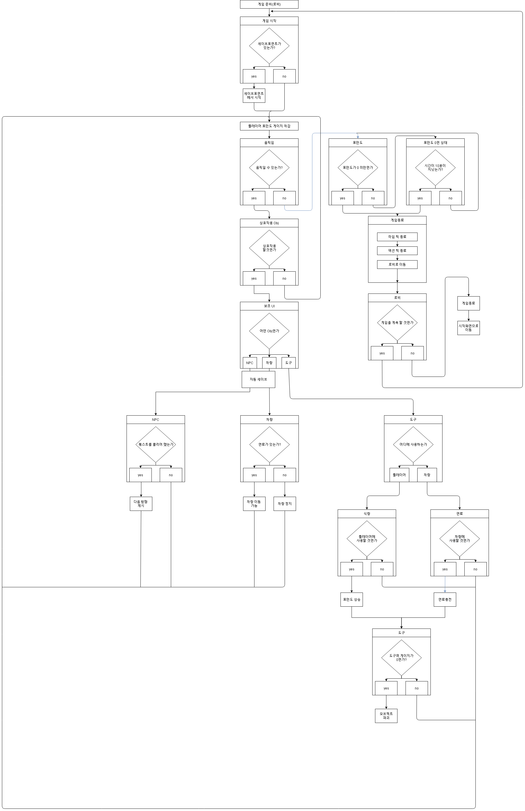

# 키보드 이벤트에 대한 흐름도  

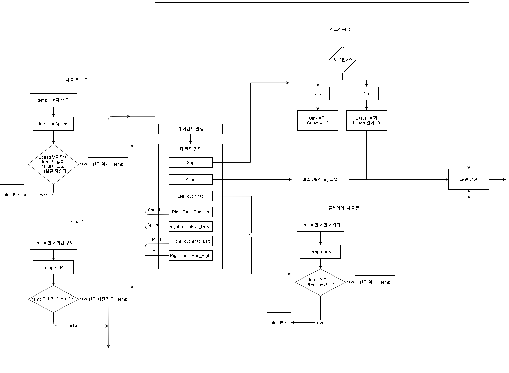

# 용어정리  

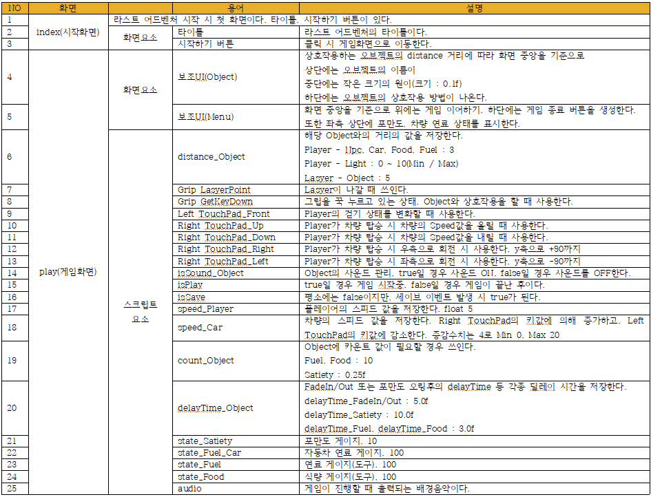

# 개발작업 일정  

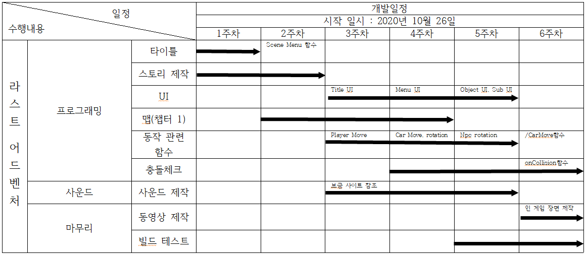
